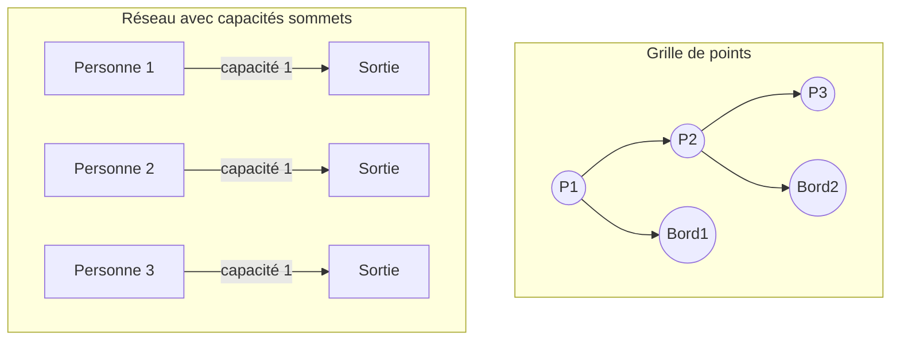
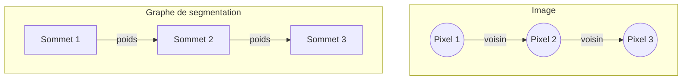
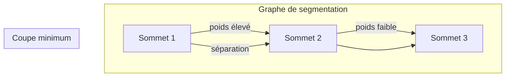

Pour résoudre ce TD sur les flots et les réductions en utilisant des graphes sous forme de diagrammes Mermaid, je vais vous guider à travers chaque exercice, en expliquant les concepts tout en créant les diagrammes appropriés.

### Exercice 1 : Réduction de ˜FLOT à FLOT

Le problème ˜FLOT est une extension du problème classique de flot, avec des capacités sur les sommets, en plus des arcs. L'objectif est de montrer que ˜FLOT peut être ramené au problème FLOT classique, c'est-à-dire qu'on peut créer une instance de FLOT à partir d'une instance de ˜FLOT et résoudre cette dernière à l'aide des techniques classiques de résolution de flot maximum.

#### Solution :
L'idée est de transformer chaque sommet \(v \in V \setminus \{s, t\}\) (excepté la source et le puits) en un arc avec une capacité correspondant à celle du sommet dans le problème ˜FLOT. Pour cela, chaque sommet \(v\) est "splitté" en deux sommets \(v_{\text{in}}\) et \(v_{\text{out}}\), reliés par un arc de capacité \(c_V(v)\), qui représente la capacité du sommet dans ˜FLOT.

Mermaid diagramme pour la réduction de ˜FLOT à FLOT :

```mermaid
graph TD
    subgraph Réseau avec capacité sur les sommets (˜FLOT)
    A[s] --> B((v))
    B --> C[t]
    B -->|c_V(v)| D
    end
    
    subgraph Réseau FLOT classique
    A'([s]) --> B'((v_in))
    B' -->|c_V(v)| C'((v_out))
    C' --> D'([t])
    end
```

Dans ce diagramme, chaque sommet \(v\) dans l'instance de ˜FLOT est transformé en une paire \(v_{\text{in}}\) et \(v_{\text{out}}\) reliée par un arc avec une capacité égale à celle du sommet \(v\). Ainsi, on peut traiter les capacités des sommets comme des capacités d'arcs dans un problème de flot classique.

### Exercice 2 : Problème de l'évacuation

Dans ce problème, on a une grille \(n \times n\) avec des points qui représentent des personnes. Le but est de maximiser le nombre de personnes pouvant être évacuées vers le bord de la grille par des chemins disjoints (sans sommets communs).

#### Question 1 : Calcul de la valeur optimale pour des instances données

Supposons que l'on ait une grille 3x3 avec 4 personnes situées dans des positions spécifiques. Pour évacuer ces personnes, il faut trouver des chemins qui mènent vers le bord sans que ces chemins se croisent. La solution consiste à chercher des flots maximums dans un graphe représentant la grille.

#### Question 2 : Réduction de Π à ˜FLOT

Nous devons montrer que le problème de l'évacuation peut être réduit à un problème ˜FLOT, en représentant la grille sous forme de graphe avec des sommets ayant des capacités. Chaque point de la grille peut être représenté comme un sommet avec une capacité, et les chemins sans intersection correspondent aux flots passant par ces sommets.

Voici un exemple de réduction sous forme de diagramme Mermaid :



Ici, chaque point de la grille où une personne se trouve est représenté par un sommet avec une capacité de 1 (une personne). Les bords de la grille représentent les sorties vers lesquelles les flots doivent être acheminés.

### Exercice 3 : Réductions du TP

Dans cet exercice, vous devez étudier les réductions entre différents problèmes de segmentation d'image et leur résolution à travers des graphes.

#### Réduction SEGMENTATIONIMAGE ≤S SEGMENTATIONIMAGEGRAPHE

Pour cette réduction, il faut transformer une instance du problème de segmentation d'image en une instance du problème de segmentation d'image via des graphes. L'idée est d'associer chaque pixel de l'image à un sommet dans un graphe, et de définir des arcs entre les pixels voisins avec des poids représentant la similarité des pixels.

Diagramme Mermaid pour SEGMENTATIONIMAGE ≤S SEGMENTATIONIMAGEGRAPHE :



Chaque pixel est transformé en un sommet, et les connexions entre pixels adjacents deviennent des arcs avec des poids basés sur les similarités des pixels.

#### Réduction SEGMENTATIONIMAGEGRAPHE ≤S MINCUT

Pour cette réduction, l'objectif est de montrer que le problème de segmentation d'image via graphe peut être résolu en utilisant le problème de coupe minimum (MINCUT). L'idée est de trouver une coupe dans le graphe qui sépare les pixels de manière optimale en minimisant le coût de la coupe, ce qui correspond à la segmentation de l'image.

Mermaid diagramme pour SEGMENTATIONIMAGEGRAPHE ≤S MINCUT :



La coupe minimum dans ce graphe sépare les sommets représentant les pixels de l'image en deux groupes, ce qui correspond à la segmentation de l'image.

---

Ces diagrammes vous permettent de mieux visualiser les réductions et les problèmes à résoudre dans ce TD. Si vous avez besoin de détails supplémentaires sur un des exercices ou une autre explication, n'hésitez pas à me le faire savoir.